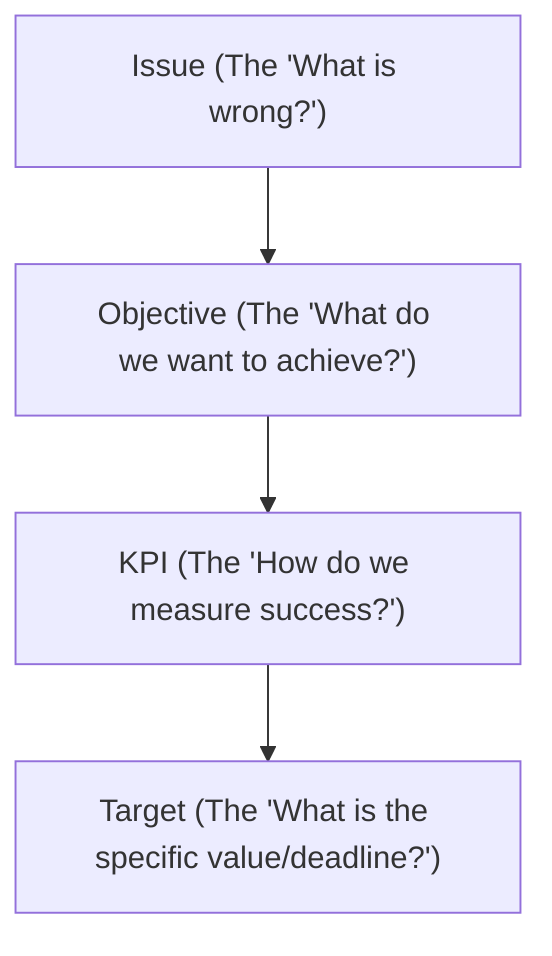

# Issue, Objective, and KPI (IOK) Framework Skill

This skill provides a structured methodology and step-by-step guidance for agents to define, structure, and track issues, objectives, and Key Performance Indicators (KPIs) across various projects (e.g., General Affairs, Legal, Compliance, Marketing, and IT).

---

## 1. Core Concepts

The IOK framework is a logical chain that connects a problem to a measurable success criteria.

| Component | Description | Example |
| :--- | :--- | :--- |
| **Issue** | A current problem, bottleneck, or area of inefficiency that needs to be addressed. | High contract approval delay causing vendor onboarding bottlenecks. |
| **Objective** | A positive, active statement of what will be achieved once the issue is solved. Must be SMART. | Streamline the legal contract approval workflow to reduce turnaround time. |
| **KPI** | The specific metric used to measure progress toward the objective. | Average turnaround time (days) per contract type. |
| **Target** | The specific numeric goal and timeframe for the KPI. | Average turnaround time ≤ 3 business days by Q3 2026. |

---

## 2. Step-by-Step Formulation Guide

### Step 2.1: Define the Issue (Problem Statement)
An issue should be described clearly without assuming the solution. Use the **5 Whys** or **Fishbone** method to identify root causes.

* **Poor:** "We need an upload button in the marketing system." (This is a solution, not an issue).
* **Better:** "Marketing team has to manually copy and paste file links from Google Drive to attach proposals, which is slow and prone to broken links."

**Template for Issue Statement:**
> **[Problem Description]** occurs in **[Context/Process]**, affecting **[Stakeholders]**, resulting in **[Negative Impact/Consequence]**.

---

### Step 2.2: Establish the SMART Objective
Transform the issue into an objective that is:
* **S**pecific: Clear about what will change, where, and for whom.
* **M**easurable: Quantifiable so progress can be tracked.
* **A**chievable: Realistic given resources and constraints.
* **R**elevant: Aligned with broader organizational goals.
* **T**ime-bound: Has a clear target completion date.

**Template for SMART Objective:**
> **[Action Verb]** the **[Process/Metric]** from **[Current Baseline]** to **[Target Goal]** by **[Target Date]**.

* *Example:* Reduce the average contract revision turnaround time from 7 business days to under 3 business days by December 31, 2026.

---

### Step 2.3: Select Key Performance Indicators (KPIs)
Select 2-3 KPIs per objective. Avoid metric bloat. Ensure you have a mix of:
1. **Leading Indicators:** Predictive metrics that show early progress (e.g., % of staff trained on the new system).
2. **Lagging Indicators:** Outcome metrics that show final results (e.g., average turnaround time).

**KPI Properties Checklist:**
* [ ] **Measurable:** Can be parsed programmatically or queried from the database.
* [ ] **Under Control:** The team has direct influence over the outcome of the metric.
* [ ] **Simple:** Easy to understand by non-technical stakeholders.

---

## 3. Reference Implementation Checklists

### Domain: General Affairs & IT Operations
* **Issue:** High cost and paper waste in physical form approval.
* **Objective:** Transition 100% of internal approvals to paperless digital forms within 6 months.
* **KPIs:**
  * Number of paper forms processed monthly (Lagging).
  * % of modules migrated to digital workflow (Leading).
  * System uptime and page load speed (Technical).

### Domain: Legal & Litigasi
* **Issue:** Missing critical vendor contract renewal dates leading to expired SLA penalties.
* **Objective:** Automate contract expiration alerts to guarantee zero expired SLAs.
* **KPIs:**
  * Number of expired active contracts (Lagging, Target: 0).
  * Average advance notification time (Days before expiry, Target: 30 days).

### Domain: Compliance & Audit
* **Issue:** Delayed response times to regulatory compliance audits.
* **Objective:** Streamline SOP documentation indexing to respond to audits within 48 hours.
* **KPIs:**
  * Average response time to audit requests (Lagging).
  * % of SOPs fully indexed with search tags (Leading).

---

## 4. How to Apply this Skill in a Conversation

When the user asks you to write, review, or implement goals or metrics:
1. **Structure the Output:** Format your response using the **Issue → Objective → KPI → Target** hierarchy.
2. **Query baseline data:** Look at the database schema (e.g. check status columns, timestamps) to see if the metrics can be queried programmatically.
3. **Draft a dashboard suggestion:** Present how these KPIs would look in a user interface (using cards, progress bars, or charts).
