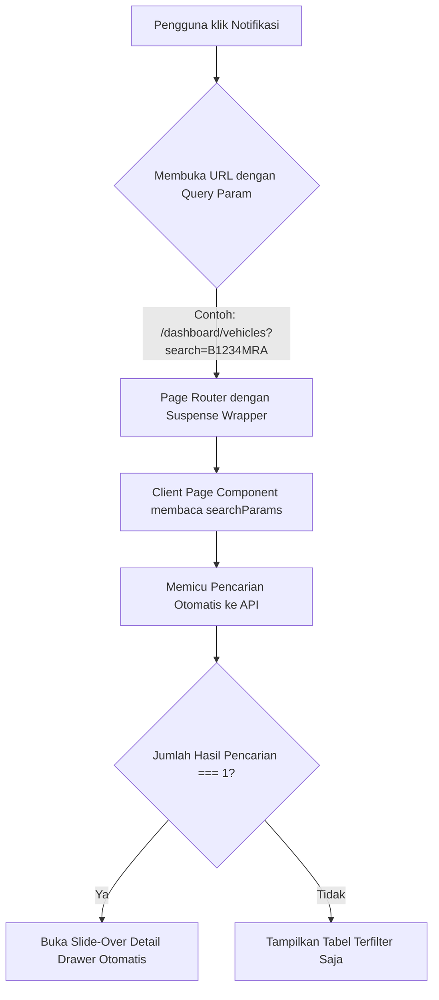

# GLC MRA System — Notification & Deep-Linking Reference

Sistem notifikasi terpadu pada GLC MRA dirancang agar pengguna dapat mengklik notifikasi (misalnya peringatan pajak kendaraan, maintenance jatuh tempo, asuransi, dll.) dan langsung diarahkan ke halaman terkait dengan filter aktif serta detail drawer yang terbuka otomatis.

---

## 1. Alur Utama Deep-Linking Notifikasi



---

## 2. Implementasi Backend (`backend/routes/`)

Setiap endpoint notifikasi (seperti `/notifications` di `gaRouter.js`) mengompilasi item peringatan dengan menambahkan parameter kueri pencarian (`?search=...`) pada properti `link`.

### Contoh Format Pembuatan Tautan:
```javascript
// Contoh untuk Pajak Kendaraan (Vehicles)
vehicles.forEach(v => {
  if (status) {
    items.push({
      id: `vehicle-${v.id}`,
      title: v.plate_number,
      subtitle: `Pajak Kendaraan — ${v.brand_model || ''}`,
      date: v.tax_date,
      status,
      link: `/dashboard/vehicles?search=${encodeURIComponent(v.plate_number)}`
    });
  }
});

// Contoh untuk Maintenance
maintenances.forEach(m => {
  if (status) {
    items.push({
      id: `maintenance-${m.id}`,
      title: m.asset_name,
      link: `/dashboard/maintenances?search=${encodeURIComponent(m.asset_name || m.detail)}`
    });
  }
});
```

---

## 3. Implementasi Frontend (Route Wrappers & Suspense)

Next.js App Router (Turbopack) mengharuskan penggunaan hook `useSearchParams()` di dalam komponen Client dibungkus oleh `<Suspense>` boundary pada level page/router wrapper agar tidak terjadi kegagalan atau peringatan pada fase build static page.

### Contoh Wrapper (`frontend/src/app/dashboard/vehicles/page.jsx`):
```javascript
import React, { Suspense } from 'react';
import GaVehiclesPage from '@/components/pages/GaVehiclesPage';
import { Loader2 } from 'lucide-react';

export default function Page() {
  return (
    <Suspense
      fallback={
        <div className="min-h-[400px] flex items-center justify-center">
          <Loader2 className="w-8 h-8 animate-spin text-blue-600" />
        </div>
      }
    >
      <GaVehiclesPage />
    </Suspense>
  );
}
```

---

## 4. Implementasi Frontend (Client Page Component)

Komponen halaman bertugas menangkap parameter pencarian, mengesampingkan keharusan menekan tombol "Proses Data" (blank state), memanggil API, dan membuka laci detail.

### 4.1. Membaca Parameter pada Mount
```javascript
import { useSearchParams } from 'next/navigation';

export default function GaVehiclesPage() {
  const searchParams = useSearchParams();
  
  // State filter standar
  const [search, setSearch] = useState('');
  const [tempSearch, setTempSearch] = useState('');
  const [hasProcessed, setHasProcessed] = useState(false);

  // Jalankan filter otomatis jika ada query params 'search'
  useEffect(() => {
    const q = searchParams.get('search');
    if (q) {
      setSearch(q);
      setTempSearch(q);
      setHasProcessed(true); // Melewati blank state / SearchingRadarAnimation
    }
  }, [searchParams]);
  
  // ...
}
```

### 4.2. Auto-Open Detail Drawer jika Tepat 1 Hasil
Di dalam fungsi `fetchData`, setelah data berhasil diambil dari API backend:
```javascript
  const fetchData = async () => {
    try {
      setLoading(true);
      const res = await apiClient.get('/api/ga/vehicles', {
        params: { search, page, limit: 10 }
      });
      
      setData(res.data || []);
      setMeta(res.meta || {});
      
      // Mekanisme Auto-Open Laci Detail
      const searchParamVal = searchParams.get('search');
      if (searchParamVal && res.data && res.data.length === 1) {
        setSelectedVehicle(res.data[0]); // Buka drawer secara otomatis
      }
    } catch (err) {
      setError(err.message);
    } finally {
      setLoading(false);
    }
  };
```

---

## 5. Daftar Halaman GA yang Menggunakan Mekanisme Ini

| Modul Halaman | Nama Berkas Komponen | Query Param Search | State Target Auto-Open |
|---------------|----------------------|--------------------|------------------------|
| Vehicles | `GaVehiclesPage.jsx` | `plate_number` | `setSelectedVehicle` |
| Maintenances | `GaMaintenancesPage.jsx` | `asset_name` / `detail` | `setSelectedMaint` |
| Vendors | `GaVendorsPage.jsx` | `vendor_name` | `setSelectedVendor` |
| Insurances | `GaInsurancesPage.jsx` | `policy_number` | `setSelectedInsurance` |
| Documents | `GaDocumentsPage.jsx` | `doc_title` | `setSelectedDoc` |
