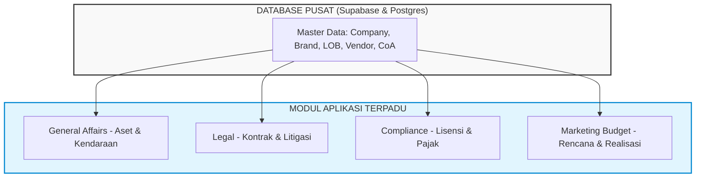

# Analisis Sistem Terintegrasi GLC MRA (General Affairs, Legal, Compliance, & Marketing Budget)
*Bahan Presentasi Manajemen Eksekutif & Stakeholder*

Dokumen ini disusun untuk membantu Anda melakukan presentasi mengenai urgensi, tujuan, dan metrik keberhasilan dari implementasi **Sistem Terpadu GLC MRA** yang meliputi modul **General Affairs (GA)**, **Legal**, **Compliance**, serta **Marketing Budget**.

---

## 1. Latar Belakang & Masalah Utama (Current Issues & Pain Points)

Sebelum adanya sistem GLC terpadu ini, seluruh operasional departemen **GA, Legal, Compliance, dan Marketing** berjalan secara terpisah (*silo*) dengan ketergantungan yang sangat tinggi pada **Microsoft Excel** dan berkas fisik (kertas). Masalah utama yang dihadapi meliputi:

### 🔴 Departemen Marketing (Budget & Approval)
* **Ketergantungan Excel & Manual**: Penyusunan alokasi budget kampanye iklan masih memakai lembar kerja Excel lokal yang rentan salah ketik formula atau salah kode akun (CoA).
* **Alur Approval Lambat**: Pengajuan rencana anggaran membutuhkan tanda tangan fisik atau email berantai yang rentan terlewat, menunda waktu peluncuran promosi produk.
* **Lemahnya Kontrol Realisasi**: Tidak ada pencegahan otomatis (*budget locking*) jika pembayaran ke vendor (*payment request*) melebihi rencana budget awal.

### 🔴 Departemen General Affairs / GA (Aset, Kendaraan & Perawatan)
* **Pencatatan Aset Fisik & Sewa Manual**: Pendataan inventaris kantor, kendaraan operasional, sewa perangkat IT/device, dan log peminjaman masih manual.
* **Perawatan Aset Tidak Terjadwal**: Sering terjadi keterlambatan servis kendaraan/aset penting (*preventive maintenance*) karena tidak adanya pengingat jadwal rutin, menyebabkan kerusakan dini dan biaya perbaikan membengkak.
* **Masa Sewa Overdue**: Kurangnya pengingat untuk tanggal pengembalian sewa perangkat IT yang berpotensi memicu denda keterlambatan.

### 🔴 Departemen Legal (Kontrak, Akta & Kasus Litigasi)
* **Kontrak Berserakan & Kertas Fisik**: Dokumen perjanjian kerja sama (*vendor agreement*), akta perusahaan, dan dokumen litigasi disimpan di folder lokal komputer staf masing-masing atau lemari arsip.
* **Risiko Keterlambatan Perpanjangan**: Sulit melacak tanggal kedaluwarsa kontrak penting secara otomatis. Keterlambatan perpanjangan berisiko memicu denda hukum atau terhentinya operasional bisnis.

### 🔴 Departemen Compliance (Lisensi Usaha, Pajak & SOP)
* **Kelalaian Kepatuhan Regulasi**: Pemantauan masa berlaku lisensi operasional perusahaan, kepatuhan pelaporan pajak, dan kepatuhan HR/SOP masih bersifat reaktif.
* **Potensi Sanksi Pemerintah**: Keterlambatan memperbarui izin usaha atau pelaporan dokumen compliance berisiko mendatangkan sanksi administratif hingga pembekuan izin operasional.

---

## 2. Tujuan Strategis Sistem Terpadu (Objectives)

Implementasi aplikasi GLC MRA dirancang untuk mentransformasi cara kerja manual menjadi digital dan terintegrasi:

### 🟢 Modul Marketing Budget: Efisiensi & Kontrol Anggaran
* **Sistem Anggaran Tersentralisasi**: Menginput kampanye iklan terstruktur lengkap dengan Brand, LOB, dan Cabang.
* **Magic Link Approval**: Mempercepat persetujuan nominal anggaran langsung lewat email penerima tanpa wajib login.
* **Budget Locking**: Membatasi realisasi pembayaran agar tidak melebihi sisa saldo anggaran awal.

### 🟢 Modul General Affairs (GA): Optimasi Siklus Aset
* **Digital Asset Inventory & Barcoding**: Inventarisasi aset secara digital yang terintegrasi dengan kode QR/barcode untuk pelacakan fisik yang akurat.
* **Preventive Maintenance Scheduling**: Otomatisasi pengingat servis rutin kendaraan dan aset operasional kantor.
* **Rental Lifecycle Management**: Dasbor pemantauan sewa perangkat IT agar pengembalian dilakukan tepat waktu sebelum terkena denda.

### 🟢 Modul Legal: Manajemen Risiko Hukum
* **Secure Contract Repository**: Wadah penyimpanan digital terpusat untuk semua draf kontrak, akta, dan dokumen legal dengan kontrol akses yang aman.
* **Milestone Alerts**: Sistem notifikasi otomatis 30/60/90 hari sebelum tanggal kedaluwarsa dokumen hukum berakhir.
* **Litigation Tracker**: Pemantauan tahapan kasus hukum/litigasi perusahaan secara transparan bagi manajemen.

### 🟢 Modul Compliance: Perlindungan Kepatuhan Operasional
* **Compliance Matrix & Reminders**: Kalender pemantauan tanggal jatuh tempo pelaporan pajak daerah/pusat dan pembaruan izin operasional.
* **SOP Digitalization**: Sentralisasi panduan operasional perusahaan agar dapat diakses dengan mudah oleh seluruh departemen yang relevan.

---

## 3. Indikator Kinerja Utama (Key Performance Indicators - KPIs)

| Departemen / Modul | Metrik Evaluasi (KPI) | Target Setelah Sistem | Dampak Bisnis (Business Impact) |
|---|---|---|---|
| **Marketing Budget** | Waktu Proses Persetujuan Anggaran | **< 24 Jam** (Sebelumnya 3-7 hari kerja) | Pengambilan keputusan promosi lebih lincah dan cepat masuk ke pasar (*time-to-market*). |
| | Kasus Belanja Melebihi Anggaran (*Over-budget*) | **0 Kasus** | Pengendalian arus kas perusahaan yang ketat dan efisiensi biaya promosi. |
| **General Affairs (GA)** | Kehilangan/Penyusutan Aset Tidak Tercatat | **< 1% per Tahun** | Proteksi nilai investasi fisik perusahaan dan transparansi audit inventaris. |
| | Biaya Perbaikan Aset Kerusakan Berat | **Turun 30%** (berkat servis terjadwal) | Memperpanjang usia pakai kendaraan & alat operasional kantor (*CAPEX saving*). |
| | Kasus Keterlambatan Sewa IT | **0 Kasus Denda** | Efisiensi biaya pengeluaran operasional non-dasar (*OPEX saving*). |
| **Legal** | Keterlambatan Perpanjangan Kontrak/Izin Kerja | **0 Kasus Keterlambatan** | Menghindari penghentian kerja sama operasional dengan vendor utama akibat kelalaian hukum. |
| | Kecepatan Temu Kembali Dokumen Hukum | **< 3 Menit** (Sebelumnya mencari di berkas fisik berjam-jam) | Produktivitas tim legal meningkat dan proses pengambilan keputusan bisnis lebih cepat. |
| **Compliance** | Skor Kepatuhan Regulasi & Lisensi (*Compliance Rate*) | **100% Patuh** | Menghilangkan denda administratif dari instansi pemerintah dan melindungi reputasi brand grup MRA. |
| | Kepatuhan Pelaporan Pajak Berkala | **Tepat Waktu (100%)** | Menghindari sanksi bunga denda pajak dari kantor pelayanan pajak. |

---

> [!IMPORTANT]
> **Pesan Utama untuk Manajemen Eksekutif:**
> Keberadaan sistem **GLC MRA** ini bukan sekadar alat administrasi baru, melainkan **fondasi digitalisasi proses bisnis grup** yang mengintegrasikan aspek kepatuhan (*Compliance*), kepastian hukum (*Legal*), pengelolaan aset (*GA*), dan akuntabilitas keuangan (*Marketing Budget*) ke dalam satu platform tunggal yang aman, transparan, dan dapat diaudit setiap saat.
